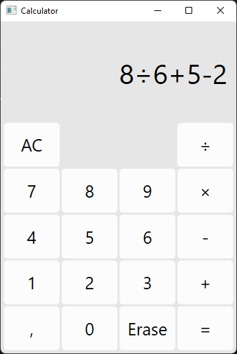

# Calculator

This is a simple calculator project I created to learn C#, WPF, MVVM and C# unit testing.

## Download

https://github.com/jimitakamaki/Calculator/releases/latest

You'll need .NET Desktop Runtime 6.0 or newer to run this app. I don't know about compatibility with older versions.

https://dotnet.microsoft.com/en-us/download

## Dependencies

See NOTICE.md file for more information.

- [WindowsCommunityToolkit](https://github.com/CommunityToolkit/WindowsCommunityToolkit)